# **關卡1A: Sunken Grotto(Hold Room)**
**通關目標: 其中一位玩家站在房間中央的樹樁上的紫色方塊區域內60秒以開啟出口**
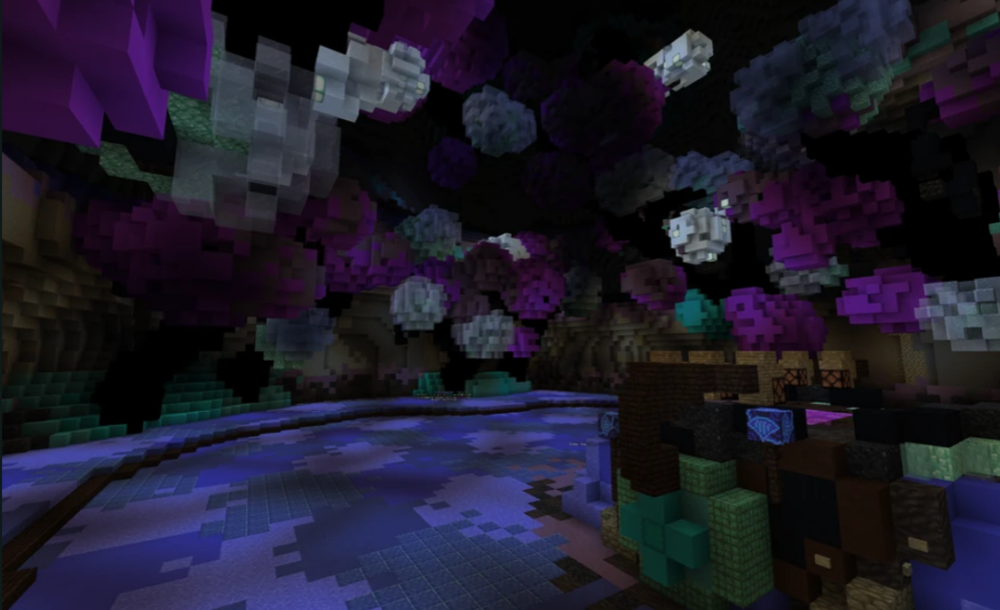

## **關卡機制**
- 每隔一段時間會有一波小怪生成。
- 每隔10秒會有Void Hole(下圖)在場地周圍生成，Void Hole發著光，應該馬上就能發現。
- Void Hole會生成後四處徘徊，並攻擊站在中央平台的玩家。
- Void Hole過一段時間會召出強力小怪Heart of Darkness，會使Void Hole回血並攻擊地面上玩家，每隔一段時間會擊飛站在平台上的玩家。
- 出口開啟後，所有活著的玩家必須都來到出口關卡才算完成。

## **關卡攻略建議**
1.  Void Hole需優先擊殺，否則會嚴重影響平台上的玩家。
2. 除非你們對自己的輸出有信心，不然絕對是高ehp或本身具有補血能力的玩家優先站中央平台(兩者兼具甚佳)。
3. 盡量不要讓Void Hole召出Heart of Darkness。
4. 站在紫色方塊的邊緣比較不容易被Void Hole攻擊。
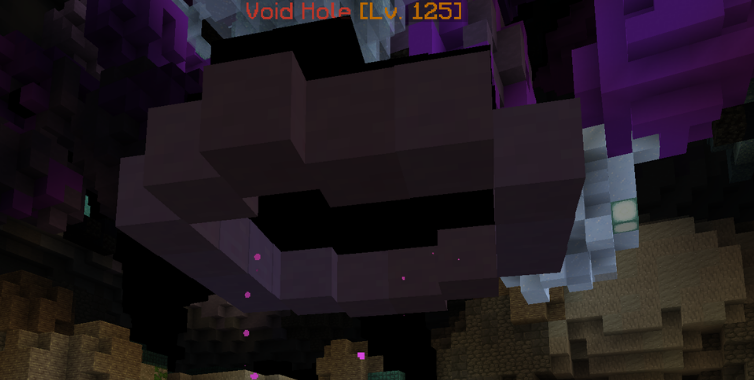

---

# **關卡1B: Flooding Canyon(Berry Room)**
**通關目標: 在兩分鐘內擊殺所有Malefic Void Rift**
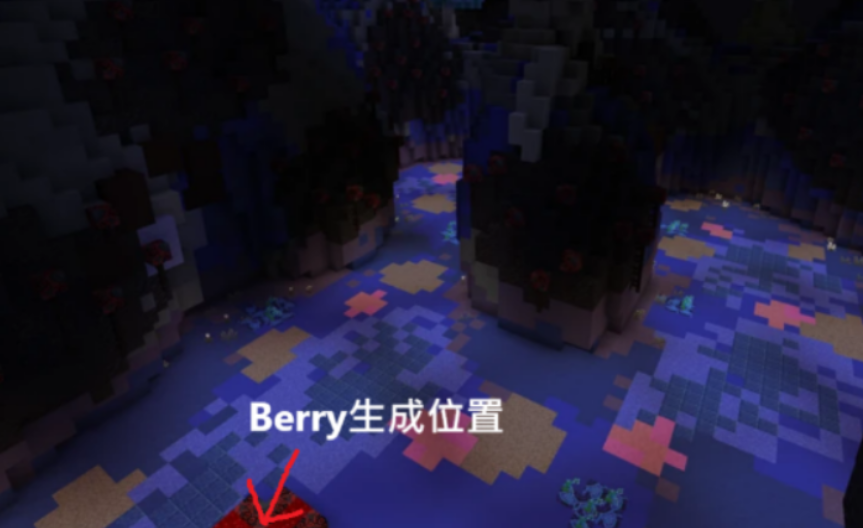
## **關卡機制**
- 房間前方的紅色平台上會出現一個berserker berry，右鍵berry將會獲得失明、普攻攻擊力大幅提升、攻擊速度強制降為super slow、無法使用技能(含粉技)。
- 只有持有Berserker Berry效果的玩家才能攻擊Void Rift
- Void Rift每隔一段時間會召出小怪，小怪的數量會隨著時間推進而提升。

## **關卡攻略建議**
1. 獲得berry效果的人要在兩分鐘內把所有Void Rift擊殺，其他人則是需要保護並引導取得berry的人擊殺Void Rift。
2. [Void Rift擊殺指引路線](https://www.mediafire.com/file/ewttyezrkllltkj/berry.json/file)
請先安裝wynntils，下載此檔案後，將檔案移到C:/user/you/AppData/Roaming/.minecraft/wynntils/lootruns
之後進到遊戲打/lootrun list，你就可以看到這個檔案出現在你的路線列表裡，之後打/lootrun load 檔案名就可以開始用了。

---

# **關卡2A: Nameless Cave(Light Room)**
**通關目標: 跟著持有光的玩家，找到三個Shadowlings，之後擊殺中央的小王Chiropterror**

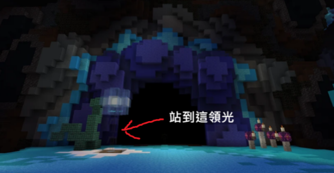

## **關卡機制**
- 一開始需要有一個人拿光，隨後所有人進入洞裡開始挑戰。
- 離開拿光的玩家太遠會扣血，並且會越扣越痛，所以不要以為可以補回來。
- 小王有可能會是稀有怪Lost Eye，會掉落稀有素材。(沒很好用，所以收起你的disco)
- 出口開啟後，所有活著的玩家必須都來到出口關卡才算完成。

## **關卡攻略建議**
1.  **有經驗再拿光**
2. 擊殺三個Shadowlings後，主流玩法是移動到出口處，在那裡打小王。

---------------------------------------

# **關卡2B: Weeping Soulroot(Tree Room)**
**通關目標: 蒐集兩個Isoptera hearts以開啟出口**
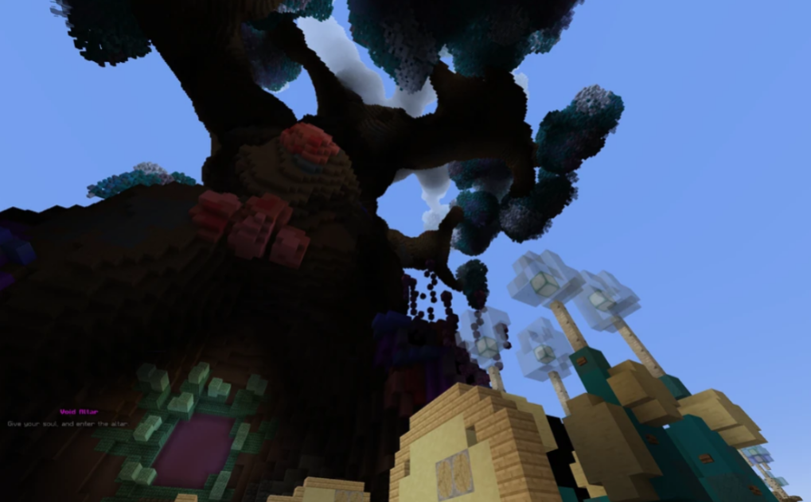
## **關卡機制**
- 樹外
  - 有四個小王Soul Shrub(下圖)，擊殺後所有參與擊殺的玩家都會拿到Soul。(進去的地方可以看到場地左右方各一個，同時左右方的地上都有海燈籠，沿著海燈籠走到場地後方可以發現另外兩個)
  - 拿到Soul後，到中央的Altar站著5秒以貢獻Soul打開樹裡的門。
  - 所有小王需要全部被擊殺才會重生新的小王。
  - 出口開啟後，所有活著的玩家必須都來到出口關卡才算完成。

  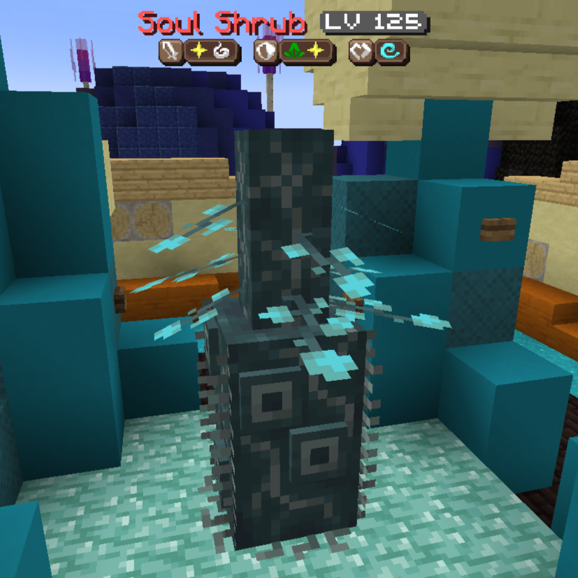

- 樹內
  - 在樹外的玩家貢獻Soul後，進樹的門和樹裡的門都會開啟。
  - 樹內有5個房間，每個房間在每次進入樹時都有機率生成小王Interdimensional Isoptera(下圖)，擊殺將會取得Isoptera hearts，將其帶到樹外的Altar處放置以開啟出口。

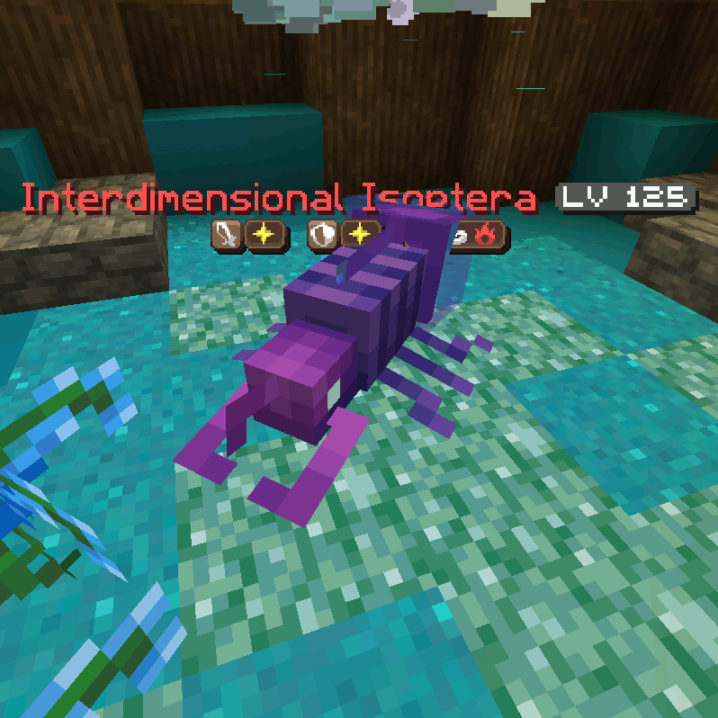

## **關卡攻略建議**
1.  **__不知道路不要進樹。__**
2. 有人在貢獻靈魂時不要接近Altar，會干擾對方。
3.  [樹內迷宮路徑 by Enderchen2580](https://www.mediafire.com/file/0xx2gh5jakaugr9/TNAtree.json/file)
同Berry路徑安裝方式。
就可以這個可以將目前公認的最快路徑之一顯示出來，方便你練習走
走了許多次有經驗後，你就不會需要這個東西了。
4. 剛進關卡時，所有玩家均自帶一個Soul，不需要先去擊殺Soul Shrub

---

# **關卡3A: Blueshift Wilds(Bulb Room)**
**通關目標: 將Blue Bulb用Red Bulb充能3次，打開出口的傳送門**
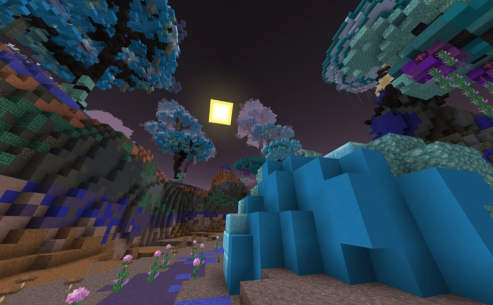

## **關卡機制**
- Blue Bulb出現後，Bulb Catcher(下圖)也會開始出現，它們會試圖取走Blue Bulb，當Blue Bulb被Bulb Catcher取走超過8秒，Blue Bulb就會消失，Raid即失敗。

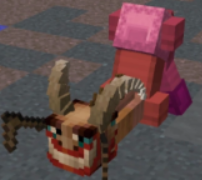

- 每隔一陣子，小王Bulb Keeper(下圖)也會在場地的接近外圍處生成，生成時聊天室會有訊息提示，擊殺後其頭上的Red Bulb會掉落，最先攻擊到Red Bulb的玩家會取得Red Bulb。
- 取得Red Bulb時，將會有瞬間失明效果，音效，以及聊天室訊息提示，此時，玩家頭上會出現一個Red Bulb，同時無法攻擊跟釋放任何技能。
- 持有Red Bulb的玩家需回到場地中央衝能Blue Bulb，充能後以上狀態就能解除。
- 出口開啟後，所有活著的玩家必須都來到出口關卡才算完成。(出口在場地中央那塊大石頭的下方)
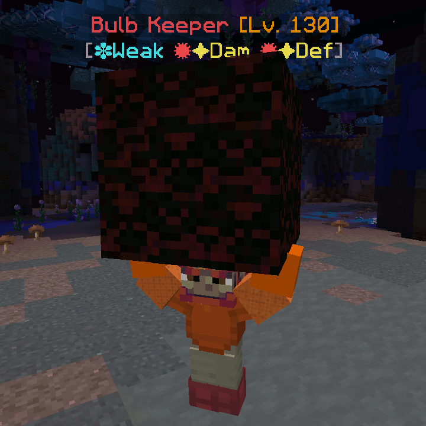
## **關卡攻略建議**
1. Bulb Keeper生成後，至少一個玩家在中央留守Blue Bulb，其餘分頭去尋找Bulb Keeper。
2. 保護持有Red Bulb的玩家，如果對方防禦力不高。

---

# **關卡3B: Twisted Jungle(Void Hole Room)**
**通關目標: 防守Giant Void Hole並取得5個Void Matter打開出口**
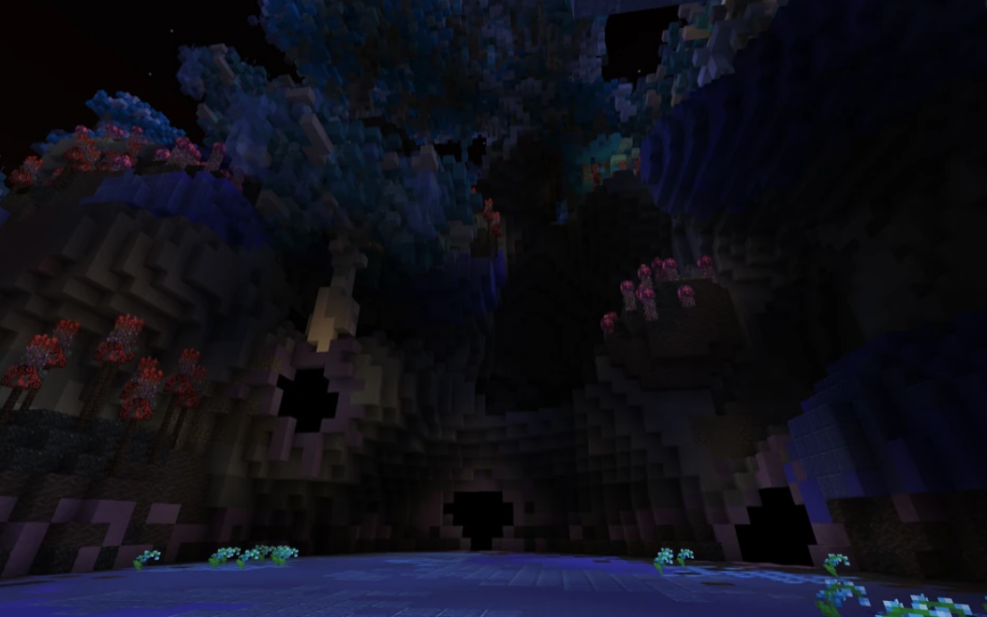
## **關卡機制**
- 只有藍色名字的怪物會攻擊Giant Void Hole，被攻擊到10次Raid即失敗
- 蒐集到4個Void Matter後，怪物會開始頻繁出現，除了擊殺怪物以外，玩家也要攻擊召喚怪物的3個Void Hole，這可以加快小王的出現速度。
- 最後，小王Despairing Crawler(下圖)出現，擊殺以獲得第5個Void Matter
- 出口開啟後，所有活著的玩家必須都來到出口關卡才算完成

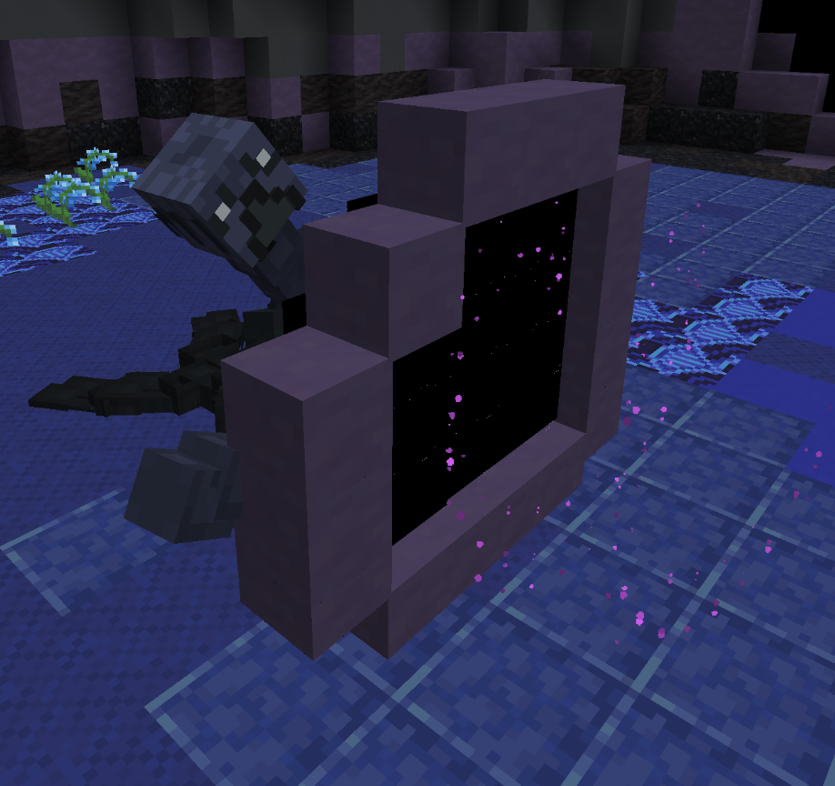

- 第一個Void Matter取得方式:

在面向Giant Void Hole的最左手方，有一個跑酷，該跑酷有三條路，
左邊跑到終點有一個pedestals，對它點右鍵以啟動它，再來完成右邊的跑酷，終點一樣有一個pedestals，也是對它點右鍵以啟動它，最後則是中間，最後會跳進一個洞，Void Matter就在裡面，打掉它以取得。

- 第二個Void Matter取得方式:

面向Giant Void Hole的左手方，有一個地上全是紅色方塊的通道，走到底會有一個小王Dendrite Drifter生成，擊殺以取得第二個Void Matter。

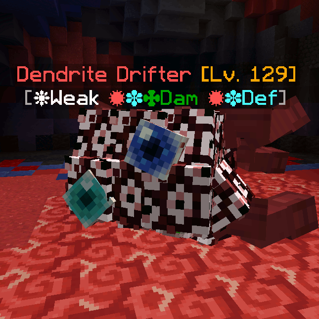

- 第三個Void Matter取得方式:

面向Giant Void Hole的右手方，有另一個跑酷，跑到最底部就可以領取Void Matter，注意跑酷平台上的尖刺Void Egg，打死或是過一段時間會生成會自爆的終界蟎Destructive Void Grub。

- 第四個Void Matter取得方式:

面向Giant Void Hole的最右手方，走到底會有兩個小王Malformed Void Hole，只要打死生成位置較為後方那隻就會掉Void Matter。

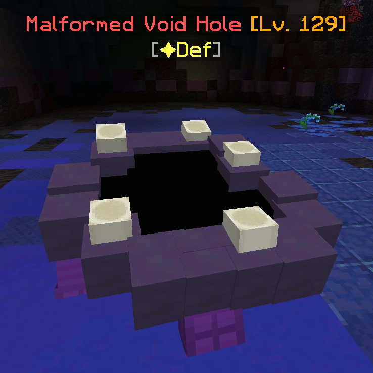

## **關卡攻略建議**
1. 一開始會先有一波怪，這時至少需要一位玩家留守Giant Void Hole，等怪物的攻勢趨緩後再去幫忙取得剩下的Void Matter。
2. 優先攻擊藍名怪物。

---

# **Boss戰: The Ń̶̂à̴̅m̸̈́͠ẽ̴̈l̴͂̌e̸̿̑s̵̅s Anomaly(Greg)**
註: Greg是Wynncraft社群幫該Boss取的名字，~~同時也是@Chqrish的情人~~
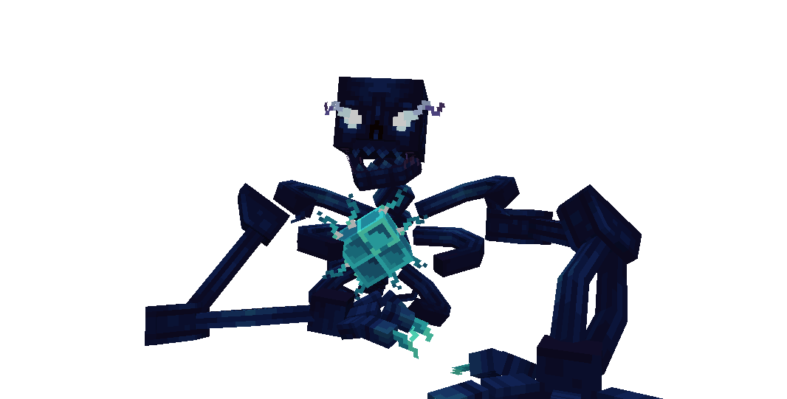

## **Boss機制**
### 虛空洞及Little/Greater One
Boss的一些攻擊會在場地上製造出虛空洞，玩家踩進虛空洞時會受到傷害，並被傳送到場地上方，接著摔落造成二次傷害。(可釋放位移技抵銷)
或是被向上彈起，同時生出Little One(下一圖)，Little One沒有威脅，但是死亡後會變成Greater One(下二圖)，Greater One會釋放高頻率的遠程攻擊，對場上的玩家造成極大的威脅，需盡快擊殺。
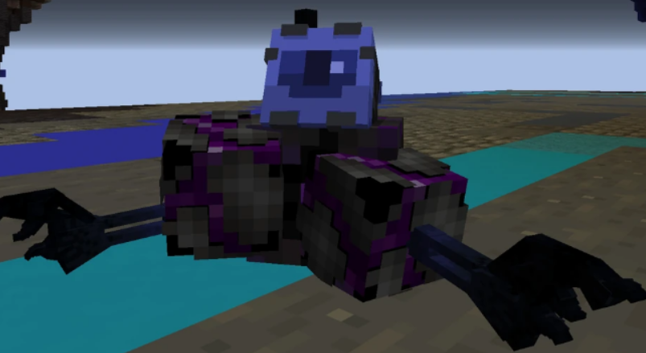
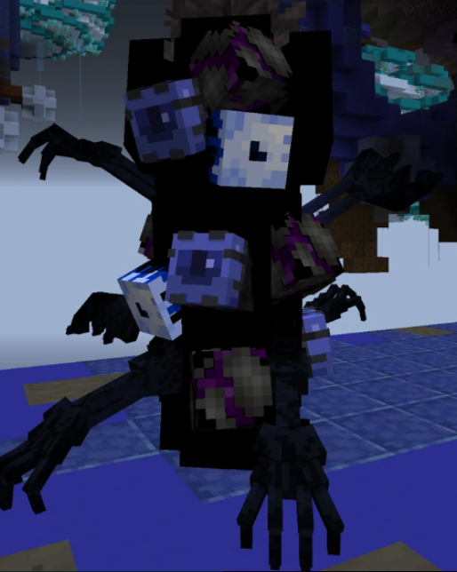

### Void Wind
場地周圍沒有屏障擋住，超出場地外時會有Void Wind強制把玩家吹回場地內，在場地外過久會開始受到傷害，傷害會逐漸提升。

## **Boss技能**
🟨 威脅沒到很高，視情況迴避。

🟧 有威脅，建議迴避，除非你相信自己。

🟥 迴避這個攻擊應該要是打這個boss的基本認知。

- 🟨 近戰
Boss為近戰AI，被Boss攻擊除了受傷，同時還會附帶拋高兼擊退，擊退距離有時候長，有時候短。

- 🟨 投射物:
Boss頭頂時不時會往隨機方向發射投射物，擊中的地方會有小範圍爆炸，被擊中會造成最大血量10%的傷害。

- 🟨 黑手
玩家頭上會出現虛空洞跟隨著，一段時間後，虛空洞會停止追蹤，並出現一個黑手從上往下壓造成傷害，只要持續移動基本上很容易躲開。

- 🟨 紫光
Boss會吼叫，隨後從眼睛發射紫光攻擊前方玩家，繞到後方就可以躲開。

- 🟨 紫圈
Boss會連續在自身底下召喚多個紫圈，在紫圈內會受到傷害並且被擊退。

- 🟧 高跳
Boss會發出**原版Minecraft音調調低的遠古守衛詛咒聲**，接著往上跳再重重落地，傷害附近玩家，同時製造出一個大虛空洞。

- 🟧 大跳
血量低於75%時釋放，首先Boss會發出**原版Minecraft終界龍的吼叫聲**，身體會做出準備起跳的動作，接著Boss會往前大跳，在落地前會持續傷害所有被跳過的玩家，同時在跳過的地板上留下多個小虛空洞，貼臉吃到這招受到的傷害會最大。

- 🟧 手
Boss會召喚多隻手，手的移動速度非常快，被抓住的玩家會造成傷害，ehp高的玩家可以硬扛，但數量一多就需要注意，輸出角則需要跑動迴避或擊殺。

- 🟧 黑頭
低於50%血量才會釋放，Boss會發出**原版Minecraft音調調高的凋零吼叫聲**，接著釋出針對每個玩家的多個黑色頭，頭會往自己鎖定的玩家衝刺多次(至少三次，如果被鎖定的玩家是處於騰空狀態會衝更多次，速度也會更快)，每個玩家都會被大約三到五個頭鎖定，如果頭撞到玩家將會造成傷害，並扣除50% Healing Efficiency，頭衝刺數次會逐漸停下並消失。
注意: 衝刺結束後逐漸停下的頭還是有攻擊性，完全消失後才是安全。在Guild Raid模式下，會改成扣除70% Healing Efficiency。

- 🟥 Watched
  - Boss會停止移動並且變成無敵狀態，~~接著擺出天上天下唯我獨尊的手勢~~，__並連續發出類似打雷的聲音__，隨後Sightseeing Interceptor會在其頭頂出現，開始Watched。
  - Watched釋放時，會先有一道白光射向所有玩家，接著會有第二道白光射向所有玩家，最後是白光混著火光射向所有玩家。
  - 被最後一道光射到的位置將會爆炸，接近爆炸中心的目標玩家將會損失50%最大血量。
  - 同時爆炸的位置還會製造出小虛空洞(在空中爆炸也一樣)，虛空洞會生出類似蟲或是藤壺的物體向上噴出多個投射物，被打到也會造成傷害。
  - 普通模式下， Watched會在Boss血量剩餘66%/33%時各釋放一波，一波Watched固定攻擊6次。
  - **Guild Raid:** Watched會釋放3波，分別是Boss血量剩餘75%/50%/25%時，每波攻擊20次，被Watched炸到的傷害提升至70%最大血量，並附帶緩速效果。場地四個角落會出現方尖碑(下圖)，玩家需要引Watched炸掉所有方尖碑(**__要炸兩次，被炸第一次尖碑會斷掉，需要再炸第二次才會徹底被摧毀__**)，所有方尖碑被摧毀後，Watched會提前結束。(如果炸到方尖碑則不會產生虛空洞)

  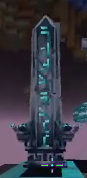

- 🟨 傳送門(Guild Raid追加)
血量低於50%後釋放，Boss大吼一聲，召喚出一個巨大的黑色傳送門，傳送門會以緩慢的速度向前移動，靠近傳送門的玩家會受傷並被傳送到場地上方，接著摔落造成二次傷害(同地上的虛空洞)。

- 🟧 眼球(Guild Raid追加)
血量低於75%後釋放，Boss拍打地面，隨後丟出多顆眼球，眼球著地會爆炸，被擊中的玩家會受到傷害。

- 🟧 虛空球(Guild Raid追加)
血量低於75%後釋放，Boss召喚出一顆虛空球浮在空中，對接近的玩家造成可觀傷害。

## Boss攻略建議
- 記好上述Boss技能對應的聲音提示。
- 如果walk speed足夠(>130%比較穩)，你可以用跑步的方式來躲watched。
- 如果walk speed不夠，則需要算準時間釋放位移技躲開(聽到第二聲準備按，第三聲跑走)，當然一直在空中飛也是可以。
- 盡量避免踩到虛空洞。

---------------------------------------
# Raid Buff
- Hollowed I
  - +2000 Health
  - +20 Defence
  - +50% Reflection
- Hollowed II
  - +30/5s Mana Regen
  - +400 Health Regen
  - +50% Thorns
- Hollowed III
  - +3500 Health
  - +400 Health Regen
  - -30% Damage
- Sojourner I
  - +20 Agility
  - +20/5s Mana Regen
  - +80% Sprint Regen
- Sojourner II
  - +40 Defence
  - -100% Sprint
  - Freerunner Major ID
- Sojourner III
  - +30 Strength
  - +30 Dexterity
  -  -150 Health Regen
- Fading I
  - +50% Health Regen
  - +30% Walk Speed
  - Heart of the Pack Major ID
- Fading II
  - +25 Agility
  - +15/3s Mana Steal
  - +25% Healing Efficency 
- Fading III
  - -10 all skill points
  - +200 Spell Damage
  - +25% Spell Damage
- Insidious I
  - +30 Intelligence
  - +12/3s Mana Steal
  - +25% Spell Damage
- Insidious II
  - +325/3s Life Steal
  - +40% Spell Damage
  - +50 Max Mana
- Insidious III
  - +60% Spell Damage
  - -40% Walk Speed
  - Sorcery Major ID
- Hopeless I
  - +20% Strength
  -  +30% Main Attack Range
  -  +75% Main Attack Damage
- Hopeless II
  - +25 Dexterity
  - +50% Exploding
  - Fission Major ID
- Hopeless III
  - +135% Main Attack Damage
  - +60% Walk Speed
  - -15/5s Mana Regen
- Manic (3rd Room Rare Buff)
  - +20/5s Mana Regen
  - -500 Health Regen
  - Madness Major ID

